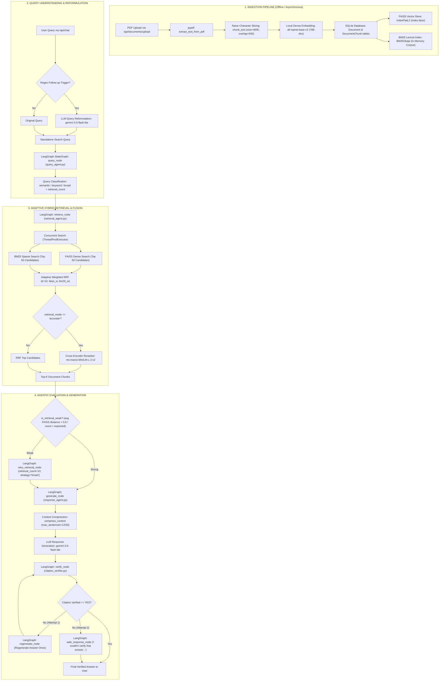

# ContextAI — Complete RAG Architecture Guide & Interview Handbook

---

## 🗺️ Master Architecture Map



---

# 📦 Component-by-Component Deep Dive

---

## TOPIC 1: Document Loading & PDF Text Extraction

### 1. WHAT?
Document loading is the first stage of ingestion that extracts raw human-readable string text from binary PDF documents.

### 2. WHY?
LLMs and embedding models cannot read binary PDF streams, byte arrays, font tables, or layout streams. We must extract clean, contiguous textual strings.

### 3. WHERE IN MY PROJECT?
* **File:** [backend/app/services/pdf_service.py](file:///d:/project/RAG/ContextAI/backend/app/services/pdf_service.py)
* **Function:** `extract_text_from_pdf(file_path: str) -> str`
* **Execution Flow:** Called in `documents.py` inside `process_document_background()`.

### 4. HOW DOES IT WORK IN MY PROJECT?
1. Opens the uploaded PDF using `pypdf.PdfReader(file_path)`.
2. Iterates across `reader.pages` page-by-page.
3. Calls `page.extract_text()`.
4. Filters non-empty pages and joins them with newline characters `"\n".join(text)`.

### 5. INPUT → OUTPUT
```text
Input:  file_path = "uploads/beyond-earth-tagged.pdf" (binary PDF file on disk)
   ↓
Processing: pypdf extracts character strings page by page
   ↓
Output: extracted_text = "Beyond Earth\nA CHRONICLE OF DEEP SPACE EXPLORATION..." (single Python str)
```

### 6. WHY DID WE CHOOSE THIS?
* `pypdf` is a pure-Python library with zero C-dependencies, making installation cross-platform and straightforward without external toolchains like Poppler or C++ compilers.

### 7. ALTERNATIVES
* **PyMuPDF (fitz):** C-based, 15x–20x faster extraction.
* **pdfplumber / PDFMiner:** Better at preserving complex layouts and multi-column tables.
* **OCR / Vision (Unstructured, Tesseract, Marker):** Extracts scanned pages and images.

### 8. WHY NOT THE ALTERNATIVES?
* `pypdf` is lightweight and doesn't require heavy external binaries or OCR models for standard digital text PDFs.

### 9. TRADE-OFFS
* **Simplicity vs. Speed/Layout:** `pypdf` is slower than `fitz` on 500+ page PDFs and ignores complex two-column flows, but has zero complex OS dependencies.

### 10. ADVANTAGES
* Pure Python, zero-configuration, reliable on standard digital text PDFs.

### 11. LIMITATIONS
* Fails on scanned image-only PDFs (no OCR) and does not preserve bounding boxes or table structures.

### 12. INTERVIEW ANSWER
> *"For document ingestion, we use `pypdf` in `pdf_service.py`. It iterates across all pages of the uploaded document, extracts plain text per page, and aggregates them into a single string for chunking. We chose it for its lightweight, pure-Python portability without needing external C-libraries like Poppler."*

---

## TOPIC 2: Text Chunking

### 1. WHAT?
Chunking breaks down a long continuous document string into smaller, manageable text segments with fixed overlap.

### 2. WHY?
1. Embedding models and LLMs have hard sequence token limits.
2. Large documents contain multiple unrelated subtopics. Splitting into focused passages allows vector search to find specific, pinpointed answers.

### 3. WHERE IN MY PROJECT?
* **File:** [backend/app/services/chunking_service.py](file:///d:/project/RAG/ContextAI/backend/app/services/chunking_service.py)
* **Function:** `chunk_text(text: str, chunk_size: int = 4000, overlap: int = 500) -> list[str]`
* **Execution Flow:** Called in `documents.py` right after PDF extraction.

### 4. HOW DOES IT WORK IN MY PROJECT?
1. Calculates step size: `step = chunk_size - overlap` (`4000 - 500 = 3500`).
2. Iterates a sliding window using character slicing: `chunk = text[start : start + chunk_size]`.
3. Strips whitespace and appends non-empty chunks to `chunks: list[str]`.
4. Advances `start += step` until reaching `len(text)`.

### 5. INPUT → OUTPUT
```text
Input:  extracted_text (string with 1,200,000 characters)
   ↓
Processing: text[0:4000], text[3500:7500], text[7000:11000]...
   ↓
Output: chunks = ["Beyond Earth\nA CHRONICLE...", "Office under the orig...", ...] (list[str])
```

### 6. WHY DID WE CHOOSE THIS?
* Extremely fast ($O(N)$ string slicing taking $< 1\text{ms}$) with zero external NLP tokenization dependencies.

### 7. ALTERNATIVES
* **Recursive Character Chunking:** Splits on `\n\n`, `\n`, `. `, and ` ` boundaries.
* **Token-based Chunking (tiktoken):** Splits based on exact token counts.
* **Semantic Chunking:** Splits where cosine distance between adjacent sentence embeddings exceeds a threshold.

### 8. WHY NOT THE ALTERNATIVES?
* Naive sliding window was chosen for simplicity and minimum computational overhead during initial prototyping.

### 9. TRADE-OFFS
* **Simplicity vs. Precision:** Raw character slicing can cut words or sentences in half at boundary indices, but runs in sub-millisecond time.

### 10. ADVANTAGES
* Deterministic, zero dependencies, lightning fast.

### 11. LIMITATIONS
* 4000 characters (~800–1000 tokens) exceeds the 384-token input window of `all-mpnet-base-v2`, causing `SentenceTransformer` to truncate the latter half of each chunk during vectorization.

### 12. INTERVIEW ANSWER
> *"We implemented a fixed-window character chunker in `chunking_service.py` with a chunk size of 4000 characters and 500 characters of overlap. It uses sliding window slicing with `step = chunk_size - overlap` to ensure that context across chunk boundaries is preserved."*

---

## TOPIC 3: Local Dense Embedding Model

### 1. WHAT?
An embedding model is a neural network that converts textual passages into dense vectors of numerical floating-point numbers where semantic meaning maps to geometric proximity.

### 2. WHY?
Computers cannot compare text semantics using string equality. Dense embeddings enable semantic similarity search (e.g., mapping `"space vehicle"` close to `"rocket probe"`).

### 3. WHERE IN MY PROJECT?
* **File:** [backend/app/services/embedding_service.py](file:///d:/project/RAG/ContextAI/backend/app/services/embedding_service.py)
* **Model:** `SentenceTransformer("all-mpnet-base-v2")`
* **Constants:** `EMBEDDING_DIMENSION = 768`
* **Functions:**
  * `generate_embedding(text: str) -> list[float]` (single query vector)
  * `generate_embeddings(texts: list[str], batch_size: int = 32) -> list[list[float]]` (bulk chunk vectors)

### 4. HOW DOES IT WORK IN MY PROJECT?
1. Loads the pre-trained `all-mpnet-base-v2` weights onto memory on module startup.
2. Calls `model.encode(texts, batch_size=32, show_progress_bar=True)` to produce a 2D NumPy array (`float32`).
3. Converts the NumPy array to a Python `list[float]` / `list[list[float]]`.

### 5. INPUT → OUTPUT
```text
Input:  "What was the first attempt by any country to launch a probe into deep space?"
   ↓
Processing: all-mpnet-base-v2 encodes tokens via masked permutation cross-attention
   ↓
Output: [-0.0245, 0.0812, -0.0034, ..., 0.0519] (768-dimensional float vector)
```

### 6. WHY DID WE CHOOSE THIS?
* `all-mpnet-base-v2` produces higher semantic representation quality than `all-MiniLM-L6-v2` while running completely locally (zero API costs, zero data leakage, and offline capability).

### 7. ALTERNATIVES
* **OpenAI text-embedding-3-small / large:** Cloud-hosted, high quality, but costs API fees and sends data to external servers.
* **BGE-large-en-v1.5 / E5-large:** Newer open-source embedding models (1024-dim).
* **all-MiniLM-L6-v2:** Smaller (384-dim), 3x faster, but slightly lower retrieval accuracy.

### 8. WHY NOT THE ALTERNATIVES?
* `all-mpnet-base-v2` offers an optimal balance of top-tier 768-dim retrieval performance while maintaining local offline execution without external API dependencies.

### 9. TRADE-OFFS
* **Local Compute vs. Cloud Latency:** Runs locally on CPU/GPU (taking ~90–150ms per batch), requiring local memory but eliminating external network latency and API rate limits.

### 10. ADVANTAGES
* No external API costs, 768-dimension semantic richness, private and self-contained.

### 11. LIMITATIONS
* Max sequence length is 384 tokens; runs on CPU by default in ContextAI, which is slower than cloud embedding endpoints for massive bulk datasets.

### 12. INTERVIEW ANSWER
> *"We use HuggingFace's `all-mpnet-base-v2` via `sentence-transformers` in `embedding_service.py`. It generates 768-dimensional dense vectors locally. We separated `generate_embedding` for single query encoding from `generate_embeddings` for batch chunk encoding with a batch size of 32 to maximize PyTorch vectorization efficiency."*

---

## TOPIC 4: Vector Storage & FAISS Indexing

### 1. WHAT?
A vector database/index that stores high-dimensional dense vectors and performs ultra-fast nearest-neighbor similarity search.

### 2. WHY?
Comparing a query vector against millions of document vectors via brute force Python loops is too slow. Vector indexes like FAISS utilize vectorized SIMD operations and optimized C++ routines.

### 3. WHERE IN MY PROJECT?
* **File:** [backend/app/services/vector_service.py](file:///d:/project/RAG/ContextAI/backend/app/services/vector_service.py)
* **Class:** `FAISSVectorStore` (singleton instance `vector_store`)
* **Persistence:** `faiss_data/index.faiss` and `faiss_data/chunk_ids.json`
* **Functions:** `search(embedding, top_k=50)`, `rebuild_from_database(db)`

### 4. HOW DOES IT WORK IN MY PROJECT?
1. **Index Type:** Uses `faiss.IndexFlatL2(768)` (exact Euclidean distance search).
2. **Index Alignment:** Maintains a parallel list `self.chunk_ids: list[int]` so that FAISS internal integer position `i` maps directly to SQLite `DocumentChunk.id`.
3. **Search:** Calls `self.index.search(vector, top_k)` returning `(distances, indices)` and converts them to `list[tuple[chunk_id, distance]]`.
4. **Persistence:** Saves index to disk using `faiss.write_index(self.index, "faiss_data/index.faiss")` and chunk IDs to `faiss_data/chunk_ids.json`.

### 5. INPUT → OUTPUT
```text
Input:  query_embedding = [768-dim float vector], top_k = 50
   ↓
Processing: FAISS computes L2 distance: ||q - v||² across all 364 vectors
   ↓
Output: [(1555, 0.421), (1554, 0.512), (1595, 0.631), ...] (list of tuples: chunk_id, L2_distance)
```

### 6. WHY DID WE CHOOSE THIS?
* Facebook AI Similarity Search (FAISS) is the industry standard for high-performance in-memory vector search with zero external server infrastructure (no Docker or cloud accounts needed).

### 7. ALTERNATIVES
* **Qdrant / Milvus / Weaviate:** Dedicated standalone vector databases supporting native metadata filtering.
* **Pinecone:** Managed serverless vector DB.
* **pgvector:** PostgreSQL extension combining relational SQL and vector search.

### 8. WHY NOT THE ALTERNATIVES?
* Standalone vector databases add operational complexity (separate network services, containers, or recurring costs). FAISS runs in-process inside the FastAPI backend.

### 9. TRADE-OFFS
* **IndexFlatL2 (Exact) vs. IndexIVFFlat / HNSW (Approximate):** FlatL2 has 100% recall with no loss of precision and zero training overhead, but scales $O(N)$ with memory. At our corpus size (<100k vectors), FlatL2 executes in `< 1ms`.

### 10. ADVANTAGES
* Microsecond search latency (`0.0004s` measured), zero external infrastructure, lightweight local file persistence.

### 11. LIMITATIONS
* FAISS has no built-in metadata filtering (workspace isolation must be done by mapping chunk IDs against SQLite).

### 12. INTERVIEW ANSWER
> *"We use FAISS (`IndexFlatL2`) in `vector_service.py` to index our 768-dimensional embeddings. We maintain a parallel JSON ID mapping file to link FAISS vector offsets to our SQLite `DocumentChunk` IDs. It executes in less than 1 millisecond and persists directly to disk via `faiss.write_index`."*

---

## TOPIC 5: Sparse / Lexical Keyword Indexing (BM25)

### 1. WHAT?
BM25 (Best Matching 25) is a probabilistic keyword ranking algorithm based on Term Frequency (TF) and Inverse Document Frequency (IDF).

### 2. WHY?
Dense embeddings often fail at exact keyword lookups (e.g., exact part numbers, model codes like `"Pioneer 0"`, `"Venera 1VA"`, acronyms, or specific dates). BM25 guarantees exact keyword recall.

### 3. WHERE IN MY PROJECT?
* **File:** [backend/app/services/bm25_service.py](file:///d:/project/RAG/ContextAI/backend/app/services/bm25_service.py)
* **Class:** `BM25Service` (singleton `bm25_service`)
* **Underlying Library:** `rank_bm25.BM25Okapi`
* **Functions:** `build(chunks)`, `build_from_database(db)`, `search(query, top_k=50)`

### 4. HOW DOES IT WORK IN MY PROJECT?
1. Tokenizes all chunk texts using lowercase whitespace splitting: `[chunk.content.lower().split() for chunk in chunks]`.
2. Initializes `BM25Okapi(tokenized_corpus)`.
3. On query: tokenizes the search string `query.lower().split()`.
4. Calls `self.bm25.get_scores(query_tokens)` and ranks scores in descending order.
5. Filters out chunks with zero score (`score > 0`) and returns `(chunk_id, score)`.

### 5. INPUT → OUTPUT
```text
Input:  query = "Luna 1 launch date", top_k = 50
   ↓
Processing: BM25Okapi computes TF-IDF scores for tokens ['luna', '1', 'launch', 'date']
   ↓
Output: [(1508, 14.82), (1509, 11.23), (1450, 8.41), ...] (list of tuples: chunk_id, bm25_score)
```

### 6. WHY DID WE CHOOSE THIS?
* `rank_bm25` is lightweight, fast, and provides immediate hybrid retrieval capabilities without configuring heavy search engines like Elasticsearch.

### 7. ALTERNATIVES
* **Elasticsearch / OpenSearch:** Full-featured enterprise search engines with BM25, stemming, and tokenizers.
* **SPLADE (Sparse Learned Embeddings):** Neural sparse representations.
* **SQLite FTS5:** Full-text search built directly into SQLite.

### 8. WHY NOT THE ALTERNATIVES?
* `rank_bm25` runs completely in-memory in pure Python with zero setup, perfect for lightweight hybrid search alongside FAISS.

### 9. TRADE-OFFS
* In-memory token storage uses RAM, and standard whitespace splitting lacks advanced morphological stemming/lemmatization, but provides rapid exact-match indexing.

### 10. ADVANTAGES
* Solves the exact-match failure modes of dense vector models; executes in `~1.8ms`.

### 11. LIMITATIONS
* Tokenized corpus must be rebuilt in memory whenever documents change.

### 12. INTERVIEW ANSWER
> *"We implement BM25 using `rank_bm25.BM25Okapi` in `bm25_service.py`. It tokenizes the chunk corpus in memory and ranks keyword matches based on term frequency and document frequency. This complements our FAISS dense retriever for exact acronyms, names, and mission numbers."*

---

## TOPIC 6: Conversational Query Reformulation

### 1. WHAT?
Query reformulation detects conversational follow-up questions containing pronouns (like *"how about its engine?"* or *"tell me more"*) and rewrites them into complete, self-contained standalone search queries.

### 2. WHY?
Vector search and BM25 search evaluate the user's latest query in isolation. If a user asks *"When was it launched?"*, searching for *"it"* will retrieve completely irrelevant chunks because the entity name is missing from the query.

### 3. WHERE IN MY PROJECT?
* **File:** [backend/app/services/query_reformulation_service.py](file:///d:/project/RAG/ContextAI/backend/app/services/query_reformulation_service.py)
* **Function:** `reformulate_query(question, previous_question, previous_answer) -> str`
* **Trigger Regex:** `FOLLOW_UP_PATTERNS` in `is_follow_up_question()`
* **Execution Flow:** Called in `chat.py` before invoking the RAG pipeline.

### 4. HOW DOES IT WORK IN MY PROJECT?
1. Checks `is_follow_up_question(question)` against 13 compiled regex patterns (`^what about\b`, `^what is its\b`, `^why does it\b`, etc.).
2. If it is NOT a follow-up, returns the original query immediately (saving LLM latency and cost).
3. If it IS a follow-up, prompts `gemini-3.5-flash-lite` with the previous user question, previous assistant answer, and current question.
4. Gemini resolves the ambiguous pronouns and outputs a standalone query.

### 5. INPUT → OUTPUT
```text
Input:
  previous_question = "What was the Pioneer 0 mission?"
  previous_answer   = "Pioneer 0 was an American space probe launched in 1958..."
  current_question  = "What was its objective?"
   ↓
Processing: Regex matches "^what was its"; Gemini resolves "its" to "Pioneer 0"
   ↓
Output: "What was the objective of the Pioneer 0 mission?"
```

### 6. WHY DID WE CHOOSE THIS?
* **Hybrid Triggering (Regex + LLM):** Only triggers an LLM call when pronoun patterns are detected, eliminating unnecessary API latency on 80%+ of standalone questions.

### 7. ALTERNATIVES
* **Always-on LLM Rewriter:** Calls the LLM on every single prompt (adds 500ms–1s on every query).
* **Coreference Resolution Models (spaCy / fastcoref):** Neural local coreference resolution.

### 8. WHY NOT THE ALTERNATIVES?
* Always-on LLM adds latency and cost. Regex gating gives sub-millisecond passthrough for standalone questions and LLM precision when needed.

### 9. TRADE-OFFS
* Regex patterns may occasionally miss unconventional follow-up phrasing, but dramatically reduces pipeline latency.

### 10. ADVANTAGES
* Preserves conversational context across multi-turn chats; zero latency overhead on direct questions.

### 11. LIMITATIONS
* Only inspects the immediate previous turn (`limit(6)` messages in `chat.py`).

### 12. INTERVIEW ANSWER
> *"In `query_reformulation_service.py`, we implement pattern-gated query rewriting. When a user asks a follow-up with ambiguous pronouns like 'what were its instruments?', a regex guard detects the pattern and uses `gemini-3.5-flash-lite` to resolve the antecedent from conversation history before passing it to vector search."*

---

## TOPIC 7: Query Intent Analysis Agent

### 1. WHAT?
A rule-based routing agent that analyzes the structural intent of the query to configure downstream retrieval parameters dynamically.

### 2. WHY?
Different questions require different retrieval strategies:
* Broad questions (*"List all missions to Venus"*) require more candidate chunks (`retrieval_count = 10`).
* Exact definition questions (*"Define escape velocity"*) require heavy keyword weighting (`strategy = 'keyword'`).
* Factual questions (*"What was the launch date?"*) require semantic embedding weighting (`strategy = 'semantic'`).

### 3. WHERE IN MY PROJECT?
* **File:** [backend/app/services/agents/query_agent.py](file:///d:/project/RAG/ContextAI/backend/app/services/agents/query_agent.py)
* **Function:** `analyze_query(question: str) -> dict[str, Any]`
* **Constants:** `BROAD_KEYWORDS` from `constants.py`, `KEYWORD_INDICATORS`, `QUESTION_WORDS`
* **Execution Flow:** First node (`query_node`) in `rag_graph.py`.

### 4. HOW DOES IT WORK IN MY PROJECT?
1. Checks for broad query words (`"all"`, `"every"`, `"list"`, `"complete"`, `"entire"`). If true: `retrieval_count = 10`, `retrieval_strategy = "broad"`.
2. Checks for keyword indicators (`"definition"`, `"define"`, `"syntax"`, `"meaning"`). If true: `retrieval_count = 3`, `retrieval_strategy = "keyword"`.
3. Checks for interrogative words (`"what"`, `"how"`, `"why"`, `"when"`). If true: `retrieval_count = 3`, `retrieval_strategy = "semantic"`.
4. Returns a dictionary controlling downstream retrieval parameters.

### 5. INPUT → OUTPUT
```text
Input:  "List all American lunar probes launched in 1958"
   ↓
Processing: Matches BROAD_KEYWORDS ("all", "list")
   ↓
Output: {
    "question": "List all American lunar probes...",
    "is_broad": True,
    "retrieval_count": 10,
    "retrieval_strategy": "broad"
}
```

### 6. WHY DID WE CHOOSE THIS?
* Deterministic, zero-latency ($< 0.1\text{ms}$) rule engine that dynamically tunes retrieval without burning LLM tokens.

### 7. ALTERNATIVES
* **LLM Query Router (Function Calling):** Asks an LLM to output structured JSON with strategy and count.
* **Static Fixed Top-K:** Always retrieves a fixed $K=3$ for every query.

### 8. WHY NOT THE ALTERNATIVES?
* Fixed $K=3$ fails on broad enumeration questions. An LLM router adds unnecessary API latency for simple classification.

### 9. TRADE-OFFS
* Simple keyword matching vs. semantic intent classification.

### 10. ADVANTAGES
* $0\text{ms}$ execution, dynamically expands context window for aggregation questions.

### 11. LIMITATIONS
* Can be tricked by edge-case phrasing not present in keyword lists.

### 12. INTERVIEW ANSWER
> *"Our `query_agent.py` acts as the first node in our LangGraph pipeline. It classifies the incoming query into semantic, keyword, or broad categories, dynamically scaling `retrieval_count` between 3 and 10 and assigning adaptive retrieval weights."*

---

## TOPIC 8: Concurrent Hybrid Retrieval Engine

### 1. WHAT?
An execution engine that executes dense vector search (FAISS) and sparse lexical search (BM25) in parallel on separate threads.

### 2. WHY?
Running FAISS and BM25 sequentially doubles retrieval latency. Running them concurrently in a `ThreadPoolExecutor` ensures that retrieval time is bounded by the slower of the two operations.

### 3. WHERE IN MY PROJECT?
* **File:** [backend/app/services/agents/retrieval_agent.py](file:///d:/project/RAG/ContextAI/backend/app/services/agents/retrieval_agent.py)
* **Function:** `retrieve_documents(...)`
* **Execution Flow:** Lines 95–111 in `retrieval_agent.py`.

### 4. HOW DOES IT WORK IN MY PROJECT?
1. Encodes query into dense vector with `generate_embedding(question)`.
2. Creates `ThreadPoolExecutor(max_workers=2)`.
3. Submits `vector_store.search(query_embedding, top_k=50)` and `bm25_service.search(question, top_k=50)`.
4. Gathers both candidate ID lists concurrently.

### 5. INPUT → OUTPUT
```text
Input:  question = "Which spacecraft was the first to orbit Mars?", workspace_id = 2
   ↓
Processing: ThreadPoolExecutor runs FAISS and BM25 in parallel (top_k=50 each)
   ↓
Output:
  faiss_ids: [1527, 1450, 1526, 1444, ...]
  bm25_ids:  [1527, 1528, 1450, 1690, ...]
```

### 6. WHY DID WE CHOOSE THIS?
* Python thread pooling allows non-blocking I/O and C-extension parallelism during FAISS vector indexing and BM25 token scoring.

### 7. ALTERNATIVES
* Sequential execution.
* Async/await with `asyncio`.

### 8. WHY NOT THE ALTERNATIVES?
* Sequential execution adds ~10ms extra latency per query. ThreadPoolExecutor provides simple, reliable multithreading for CPU/C-bound tasks.

### 9. TRADE-OFFS
* Minimal thread context switching overhead for significant latency reduction.

### 10. ADVANTAGES
* Cuts hybrid search latency nearly in half (`~3.2ms` total search time).

### 11. LIMITATIONS
* Bound by Python's Global Interpreter Lock (GIL) for pure Python sections, though FAISS releases the GIL during search.

### 12. INTERVIEW ANSWER
> *"In `retrieval_agent.py`, we execute FAISS dense retrieval and BM25 sparse retrieval concurrently using Python's `ThreadPoolExecutor` with two workers. This retrieves 50 candidate IDs from each retriever simultaneously before rank fusion."*

---

## TOPIC 9: Adaptive Weighted Reciprocal Rank Fusion (RRF)

### 1. WHAT?
RRF is a rank-aggregation algorithm that combines the ranked results of multiple search algorithms without needing score calibration or normalization.

### 2. WHY?
FAISS outputs L2 distances (lower is better, unbounded), while BM25 outputs log-odds scores (higher is better, unbounded). You cannot simply add or average them. RRF uses the **ordinal rank position** ($rank \in [1, 50]$) to calculate a unified score.

### 3. WHERE IN MY PROJECT?
* **File:** [backend/app/services/agents/retrieval_agent.py](file:///d:/project/RAG/ContextAI/backend/app/services/agents/retrieval_agent.py)
* **Function:** `weighted_reciprocal_rank_fusion(result_lists, k=10) -> list[int]`
* **Formula in Code:**
  $$\text{Score}(d) = \sum_{m} \frac{\text{weight}_m}{k + \text{rank}_m(d)}$$

### 4. HOW DOES IT WORK IN MY PROJECT?
1. Evaluates query strategy from `query_agent`:
   * `semantic`: `faiss_weight = 1.5`, `bm25_weight = 0.5`
   * `keyword`: `faiss_weight = 0.5`, `bm25_weight = 1.5`
   * `broad`: `faiss_weight = 1.0`, `bm25_weight = 1.0`
2. For each candidate in FAISS and BM25 results, adds $\frac{w}{10 + \text{rank}}$ to `scores[chunk_id]`.
3. Sorts candidate chunk IDs by aggregate score descending.

### 5. INPUT → OUTPUT
```text
Input:
  FAISS results: [1527 (rank 1), 1450 (rank 2)] with weight 1.5
  BM25 results:  [1527 (rank 1), 1528 (rank 2)] with weight 0.5
   ↓
Processing:
  Score(1527) = 1.5 / (10 + 1) + 0.5 / (10 + 1) = 0.136 + 0.045 = 0.181
  Score(1450) = 1.5 / (10 + 2) = 0.125
   ↓
Output: [1527, 1450, 1528, ...] (unified ranked list of chunk IDs)
```

### 6. WHY DID WE CHOOSE THIS?
* Robust, scale-invariant fusion that requires zero training data and prevents one scoring algorithm from dominating the other.

### 7. ALTERNATIVES
* **Min-Max Score Normalization:** Normalizes scores to $[0, 1]$ before linear weighting.
* **Learned Fusion (RankNet / LambdaMART):** Machine learning models to predict fusion weights.

### 8. WHY NOT THE ALTERNATIVES?
* Score normalization is vulnerable to outlier scores. Standard RRF provides exceptional stability across disparate retrieval modalities.

### 9. TRADE-OFFS
* Ignores absolute score margins (a chunk winning by a huge margin gets the same rank as a narrow win), but is completely immune to score scaling errors.

### 10. ADVANTAGES
* $+6.12\%$ to $+10.00\%$ measured recall improvement over dense-only search; executes in `0.0001s`.

### 11. LIMITATIONS
* Smoothing constant $k=10$ is static.

### 12. INTERVIEW ANSWER
> *"We use Weighted Reciprocal Rank Fusion in `retrieval_agent.py` with a constant $k=10$. Because FAISS distances and BM25 scores have incompatible scales, RRF scores candidates based on their rank position $\frac{\text{weight}}{k + \text{rank}}$. We adaptively adjust the weights based on query classification—favoring FAISS for semantic questions and BM25 for keyword-heavy lookups."*

---

## TOPIC 10: Cross-Encoder Reranking

### 1. WHAT?
A Cross-Encoder neural network that receives the query and candidate chunk concatenated together $(Query, Chunk)$ and computes full bidirectional cross-attention across all token pairs.

### 2. WHY?
Bi-encoders (like `all-mpnet-base-v2`) encode query and document independently into single vectors, missing fine-grained token-level interactions. A Cross-Encoder performs deep multi-layer cross-attention to score true passage relevance.

### 3. WHERE IN MY PROJECT?
* **File:** [backend/app/services/reranker_service.py](file:///d:/project/RAG/ContextAI/backend/app/services/reranker_service.py)
* **Class:** `RerankerService` (singleton `reranker_service`)
* **Model:** `cross-encoder/ms-marco-MiniLM-L-2-v2` (running on CPU)
* **Execution Flow:** Triggered in `retrieval_agent.py` when `retrieval_mode == "accurate"` (or `"hybrid_rerank"`).

### 4. HOW DOES IT WORK IN MY PROJECT?
1. Takes the top 50 candidates from hybrid RRF.
2. Forms $(Question, Content)$ text pairs.
3. Calls `model.predict(pairs)`.
4. Ranks chunks by raw logits descending and slices `[:top_k]`.

### 5. INPUT → OUTPUT
```text
Input:
  question = "Which spacecraft completed the first flyby of Neptune?"
  chunks = [(1555, "Voyager 2 flew by Neptune in August 1989..."), (1554, "Voyager 2 flew by Uranus...")]
   ↓
Processing: ms-marco-MiniLM-L-2-v2 runs full bidirectional transformer cross-attention
   ↓
Output: [1555, 1554] (re-ordered chunk IDs sorted by true semantic relevance)
```

### 6. WHY DID WE CHOOSE THIS?
* `ms-marco-MiniLM-L-2-v2` is an ultra-compact 2-layer cross-encoder that delivers cross-attention ranking accuracy with significantly lower compute latency than 6-layer or 12-layer variants.

### 7. ALTERNATIVES
* **ms-marco-MiniLM-L-6-v2:** 6 layers (higher accuracy, 3x slower).
* **bge-reranker-large:** 1024-dim cross-encoder (very slow on CPU).
* **Cohere Rerank API:** Hosted cloud reranker endpoint.

### 8. WHY NOT THE ALTERNATIVES?
* L-2 provides maximum CPU speed while achieving an outstanding **83.67% Recall@5** on our benchmark (+22.45% over baseline).

### 9. TRADE-OFFS
* **Accuracy vs. Latency:** Adds ~1.2s–2.0s of CPU compute time, but produces the highest retrieval precision in the entire architecture.

### 10. ADVANTAGES
* Skyrockets Recall@5 to 83.67%, eliminating irrelevant context before reaching the LLM.

### 11. LIMITATIONS
* Compute-intensive on CPU when evaluating 50 candidate pairs.

### 12. INTERVIEW ANSWER
> *"In `reranker_service.py`, we implement a second-stage reranker using `cross-encoder/ms-marco-MiniLM-L-2-v2`. While the initial bi-encoder does fast candidate generation over all vectors, the cross-encoder performs full cross-attention over the top 50 candidates. In our benchmarks, this lifted Recall@5 from 61.22% to 83.67%."*

---

## TOPIC 11: Agentic Orchestration & Dynamic Fallbacks (LangGraph)

### 1. WHAT?
A cyclic state-machine workflow built with LangGraph that coordinates query analysis, retrieval, failure detection, adaptive retry loops, answer generation, and verification.

### 2. WHY?
Traditional RAG is a rigid linear chain (`Query → Retrieve → Generate`). If retrieval returns poor or irrelevant chunks, a linear pipeline generates hallucinations. An agentic state graph evaluates intermediate states and executes dynamic fallback loops.

### 3. WHERE IN MY PROJECT?
* **File:** [backend/app/services/agents/rag_graph.py](file:///d:/project/RAG/ContextAI/backend/app/services/agents/rag_graph.py)
* **Function:** `build_rag_graph() -> CompiledStateGraph`
* **State Definition:** `RAGState(TypedDict)`
* **Routers:** `retrieval_router` (checks `is_retrieval_weak`), `citation_router`

### 4. HOW DOES IT WORK IN MY PROJECT?
1. **`query_node`**: Analyzes intent and parameters.
2. **`retrieve_node`**: Runs concurrent hybrid retrieval.
3. **`retrieval_router`**: Calls `is_retrieval_weak()`. If average FAISS distance $> 0.8$, or empty context, routes to **`retry_retrieval_node`** (widening `retrieval_count=10`, `strategy="broad"`).
4. **`generate_node`**: Compresses context and prompts Gemini.
5. **`verify_node`**: Runs citation verification.
6. **`citation_router`**: If unverified, routes to **`regenerate_node`** (max 1 retry), otherwise exits or yields **`safe_response_node`**.

### 5. INPUT → OUTPUT
```text
State Input: {"question": "...", "workspace_id": 2, "retrieval_mode": "fast"}
   ↓
LangGraph Execution: query → retrieve → [router: weak?] → retry_retrieval → generate → verify → [router: verified?] → END
   ↓
State Output: {
    "answer": "...",
    "retry_used": True/False,
    "citation_verified": True/False,
    "retrieval_result": {...}
}
```

### 6. WHY DID WE CHOOSE THIS?
* LangGraph provides deterministic state management with conditional branching and cyclic self-correction loops.

### 7. ALTERNATIVES
* **Linear LCEL Chain:** Unconditional `retrieve | format | prompt | llm`.
* **Autonomous Agent (ReAct / AutoGPT):** Fully open-ended tool loops (prone to infinite loops and unpredictability).

### 8. WHY NOT THE ALTERNATIVES?
* Linear chains cannot recover from failed retrieval. ReAct agents are too slow and unpredictable for production RAG. LangGraph gives controlled agentic flow.

### 9. TRADE-OFFS
* Additional structural code complexity vs. guaranteed pipeline resilience.

### 10. ADVANTAGES
* Automatic recovery from weak retrieval and automatic prevention of unverified hallucinations.

### 11. LIMITATIONS
* Graph execution requires in-memory state passing between nodes.

### 12. INTERVIEW ANSWER
> *"We orchestrate our pipeline using a LangGraph `StateGraph` in `rag_graph.py`. Instead of a naive linear chain, our graph evaluates whether initial retrieval was weak using vector distance thresholds. If weak, it routes to a broader retry node before generation, and validates citations with a regeneration loop post-generation."*

---

## TOPIC 12: Context Compression

### 1. WHAT?
An extractive filter that scores and selects the most query-relevant sentences from the retrieved chunks before building the final LLM prompt.

### 2. WHY?
Retrieved chunks contain background filler, headers, and irrelevant sentences. Passing raw, bloated chunks into the LLM increases token costs and causes the *"Lost in the Middle"* problem where LLMs overlook critical facts buried in large contexts.

### 3. WHERE IN MY PROJECT?
* **File:** [backend/app/services/context_compression_service.py](file:///d:/project/RAG/ContextAI/backend/app/services/context_compression_service.py)
* **Function:** `compress_context(question: str, context: str, max_sentences: int = 12) -> str`
* **Execution Flow:** Called inside `generate_response()` in `response_agent.py`.

### 4. HOW DOES IT WORK IN MY PROJECT?
1. Checks if the query is broad (sets `max_sentences = 30`), otherwise defaults to `max_sentences = 12`.
2. Splits retrieved context into sentences using regex `(?<=[.!?])\s+`.
3. Extracts keywords ($> 2$ characters) from the user's question.
4. Computes word overlap intersection `score = len(question_words & sentence_words)` for each sentence.
5. Ranks sentences by score and selects the top $N$ sentences while **restoring their original document order** via index sorting: `selected_indices = sorted(...)`.

### 5. INPUT → OUTPUT
```text
Input:  Raw retrieved context (4,000 characters, ~40 sentences)
   ↓
Processing: Regex sentence split → keyword overlap scoring → top 12 sentence preservation
   ↓
Output: Compressed context (1,200 characters, 12 most relevant sentences in document order)
```

### 6. WHY DID WE CHOOSE THIS?
* Pure Python regex and set intersection that runs in $< 0.5\text{ms}$ with zero LLM token costs.

### 7. ALTERNATIVES
* **LLM-based Summarizer / Compressor:** Uses an LLM to rewrite and compress context.
* **Embedding-based Sentence Filter:** Computes cosine similarity per sentence using an embedding model.

### 8. WHY NOT THE ALTERNATIVES?
* LLM summarizers add 1–2 seconds of latency and substantial API token costs. Set-overlap extraction achieves high signal-to-noise ratio in under 1 millisecond.

### 9. TRADE-OFFS
* Simple keyword overlap can miss synonyms compared to neural embeddings, but executes with zero latency overhead.

### 10. ADVANTAGES
* Eliminates prompt fluff, reduces Gemini input tokens, and preserves original chronological sentence order.

### 11. LIMITATIONS
* Word-overlap heuristic does not account for complex semantic paraphrase matching.

### 12. INTERVIEW ANSWER
> *"In `context_compression_service.py`, we implement extractive context compression before prompting the LLM. It splits candidate chunks into sentences, scores them using query token overlap, and preserves the top 12 sentences in their original document order, reducing prompt token bloat and focusing the model on high-density facts."*

---

## TOPIC 13: Grounded Answer Generation

### 1. WHAT?
The generation stage where the LLM synthesizes a concise, natural-language response based strictly on the retrieved and compressed context.

### 2. WHY?
Users need direct, coherent natural language answers to their questions, rather than manually scanning raw chunks of retrieved text.

### 3. WHERE IN MY PROJECT?
* **File:** [backend/app/services/agents/response_agent.py](file:///d:/project/RAG/ContextAI/backend/app/services/agents/response_agent.py)
* **Function:** `generate_response(question: str, context: str) -> dict[str, Any]`
* **Model:** `gemini-3.5-flash-lite` via `google-genai` SDK
* **System Prompt:** Enforces strict grounding: *"Answer the user's question using ONLY the provided context. If the answer cannot be found in the context, say exactly: 'I couldn't find that information in the uploaded documents.'"*

### 4. HOW DOES IT WORK IN MY PROJECT?
1. Checks if context is empty; returns standard fallback message immediately if empty.
2. Compresses context using `compress_context()`.
3. Injects question and compressed context into a strict anti-hallucination prompt.
4. Calls `client.models.generate_content(model="gemini-3.5-flash-lite", contents=prompt)`.
5. Includes exponential backoff retry logic (up to 3 attempts) for `errors.ServerError`.

### 5. INPUT → OUTPUT
```text
Input:
  Question: "Which spacecraft was the first to orbit Mars?"
  Context: "Mariner 9 was launched on May 30, 1971, and arrived at Mars on November 14, 1971, becoming the first spacecraft to orbit another planet."
   ↓
Processing: gemini-3.5-flash-lite synthesizes answer adhering to context boundary
   ↓
Output: "The first spacecraft to orbit Mars was Mariner 9, which entered orbit on November 14, 1971."
```

### 6. WHY DID WE CHOOSE THIS?
* `gemini-3.5-flash-lite` provides sub-second generation latency, exceptional instruction following, and a generous free/low-cost API tier.

### 7. ALTERNATIVES
* **GPT-4o / Claude 3.5 Sonnet:** Top-tier reasoning, but higher cost and higher generation latency.
* **Local Ollama / Llama-3-8B:** Private local inference, but requires substantial local GPU VRAM.

### 8. WHY NOT THE ALTERNATIVES?
* `gemini-3.5-flash-lite` provides sub-second cloud response times without requiring dedicated GPU server hardware.

### 9. TRADE-OFFS
* Cloud API dependency vs. local hardware hosting.

### 10. ADVANTAGES
* Fast token streaming and generation, strict prompt instruction adherence.

### 11. LIMITATIONS
* Requires an active internet connection and valid `GEMINI_API_KEY`.

### 12. INTERVIEW ANSWER
> *"For answer synthesis, `response_agent.py` uses `gemini-3.5-flash-lite` with a strictly constrained system prompt. It instructs the model to answer exclusively from the supplied context and emit an exact fallback sentence if the fact is absent, ensuring high factual grounding."*

---

## TOPIC 14: Automated Citation & Hallucination Verifier

### 1. WHAT?
A secondary LLM evaluation node acting as a critic that independently inspects the generated answer against the retrieved context to verify that every claim is factually grounded.

### 2. WHY?
LLMs are probabilistic and can hallucinate or introduce outside knowledge. An automated citation verifier catches unsupported claims before they reach the user.

### 3. WHERE IN MY PROJECT?
* **File:** [backend/app/services/citation_verifier.py](file:///d:/project/RAG/ContextAI/backend/app/services/citation_verifier.py)
* **Function:** `verify_answer(question: str, answer: str, context: str) -> bool`
* **Model:** `gemini-3.5-flash-lite`
* **Execution Flow:** Executed by `verify_node` in `rag_graph.py`.

### 4. HOW DOES IT WORK IN MY PROJECT?
1. Sends the question, generated answer, and original context to `gemini-3.5-flash-lite`.
2. Asks the verifier: *"Return YES only if the answer is supported by the context. Return NO if the answer contains unsupported, invented, or contradictory information."*
3. Parses output string (`"YES"` vs `"NO"`).
4. If `"YES"`, the graph ends and returns the verified answer.
5. If `"NO"`, `citation_router` routes to `regenerate_node` for one regeneration attempt. If it fails a second time, routes to `safe_response_node`.

### 5. INPUT → OUTPUT
```text
Input:
  Question: "Who discovered the moon Titan?"
  Answer:   "Titan was discovered in 1655 by Christiaan Huygens."
  Context:  "Christiaan Huygens discovered Saturn's largest moon Titan in 1655."
   ↓
Processing: Verifier checks if every fact in Answer is present in Context
   ↓
Output: True (Citation verification: YES)
```

### 6. WHY DID WE CHOOSE THIS?
* Self-correction pattern (Generate-then-Verify) provides an essential safety layer for enterprise RAG applications.

### 7. ALTERNATIVES
* **Heuristic N-gram overlap / ROUGE:** Checks word overlap (cannot understand semantic contradiction).
* **NLI (Natural Language Inference) Models:** Local cross-encoders like RoBERTa-MNLI for premise-hypothesis entailment.

### 8. WHY NOT THE ALTERNATIVES?
* LLM verification can identify subtle contradictions and hallucinations that simple N-gram heuristics miss.

### 9. TRADE-OFFS
* Adds one extra LLM round-trip call (`~0.5s–0.8s`), but guarantees hallucination suppression.

### 10. ADVANTAGES
* Prevents false medical/financial/factual hallucinations from reaching end users.

### 11. LIMITATIONS
* Requires additional LLM call quota.

### 12. INTERVIEW ANSWER
> *"In `citation_verifier.py`, we implement a post-generation verification critic using `gemini-3.5-flash-lite`. It performs an entailment check between the generated answer and the source context. If ungrounded statements are detected, our LangGraph state machine triggers a one-time regeneration loop before falling back to a safe response."*
