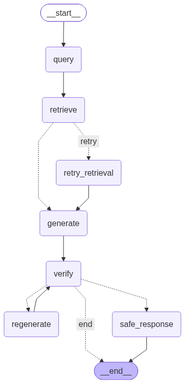

# ContextAI

ContextAI is a modular Retrieval-Augmented Generation (RAG) platform designed for document-grounded question answering with isolated multi-tenant workspaces.

The system combines dense semantic vector search (FAISS), sparse lexical search (BM25), adaptive Reciprocal Rank Fusion (RRF), and cross-encoder reranking to optimize retrieval quality. Queries are orchestrated through a compiled LangGraph workflow that incorporates query analysis, weak retrieval detection with automated retry, LLM response synthesis via Google Gemini, and citation verification to reduce hallucinations.

ContextAI includes an empirical evaluation harness with 50 human-verified benchmark questions to systematically evaluate retrieval strategies, latency profiles, and failure modes.

---

## Key Features

- **Dense Semantic Retrieval (FAISS)**: Vector similarity search using local `all-mpnet-base-v2` embeddings (768 dimensions) for semantic and conceptual matching.
- **Sparse Lexical Retrieval (BM25)**: Exact keyword and entity matching using `rank-bm25` (BM25Okapi) for precise acronym, code, and terminology lookups.
- **Hybrid Retrieval with Reciprocal Rank Fusion (RRF)**: Weighted RRF algorithm that dynamically balances semantic and keyword ranking based on query classification.
- **Cross-Encoder Reranking**: Two-stage retrieval pipeline using `cross-encoder/ms-marco-MiniLM-L-2-v2` to score joint query-document interactions over candidate chunks.
- **Query Analysis & Reformulation**: Intent classifier (semantic, keyword-focused, or broad) that dynamically adjusts context budgets and resolves multi-turn conversational follow-ups.
- **Agentic LangGraph Orchestration**: StateGraph workflow featuring automated weak-retrieval retries, response generation, and post-generation citation verification against retrieved context.
- **Multi-Workspace Isolation**: Workspace-scoped document ingestion, chunking (with overlap), and isolated database queries.
- **Evaluation Suite**: Automated benchmark reporting Recall@5, latency distributions (average and P95), and failure diagnostics.
- **Full-Stack Interface**: React 19 and Vite frontend with Tailwind CSS, Markdown and citation rendering, workspace management, and light/dark theme support.

---

## Architecture

ContextAI separates document ingestion from the runtime retrieval and generation loop:

1. **Ingestion**: Uploaded PDF documents are parsed via `pypdf`, chunked with configurable character overlap, indexed into a local FAISS vector store, and stored alongside lexical BM25 token tables in SQLite.
2. **Query Processing**: Conversational follow-ups are reformulated, analyzed for retrieval intent, and routed to the configured retrieval pipeline.
3. **Graph Execution**: A compiled LangGraph `StateGraph` evaluates retrieval adequacy; if retrieval confidence is low, a broadened retry is executed before synthesizing answers and validating citations.

```mermaid
flowchart TD
    subgraph Ingestion["Document Ingestion Pipeline"]
        PDF["PDF Upload"] --> Extract["Text Extraction (pypdf)"]
        Extract --> Chunk["Chunking & Overlap"]
        Chunk --> DB["SQLite (DocumentChunk)"]
        Chunk --> DenseEmbed["Embeddings (all-mpnet-base-v2)"]
        DenseEmbed --> FAISSIdx["FAISS IndexFlatL2"]
        DB --> BM25Idx["BM25 Index (BM25Okapi)"]
    end

    subgraph Runtime["Agentic Query Pipeline (LangGraph)"]
        UserQ["User Query"] --> Reformulate["Query Reformulation"]
        Reformulate --> QueryNode["Query Analysis Node"]
        QueryNode --> RetrieveNode["Retrieve Node (FAISS + BM25 + RRF)"]
        
        RetrieveNode --> WeakCheck{"Weak Retrieval?"}
        WeakCheck -->|"Yes (Low Confidence)"| RetryNode["Retry Retrieval (Broad Strategy)"]
        WeakCheck -->|"No"| GenerateNode["Generate Response (Gemini)"]
        RetryNode --> GenerateNode
        
        GenerateNode --> VerifyNode["Citation Verification"]
        VerifyNode --> CitationCheck{"Verified?"}
        CitationCheck -->|"Valid"| FinalAnswer["Final Answer + Sources"]
        CitationCheck -->|"Invalid (Retry)"| RegenerateNode["Regenerate Answer"]
        RegenerateNode --> VerifyNode
        CitationCheck -->|"Failed Max Retries"| SafeFallback["Safe Fallback Response"]
    end
```



### Compiled LangGraph Execution Graph

Below is the compiled execution graph generated directly from `rag_graph.py`:



---

## Retrieval Pipeline

ContextAI implements four distinct retrieval strategies to evaluate performance and latency tradeoffs:

```
User Query
   │
   ├──► Dense Retrieval (FAISS top-50) ────────┐
   │                                            ▼
   └──► Sparse Retrieval (BM25 top-50) ──► Weighted RRF (Top Candidates)
                                                │
                                                ├──► [Fast Mode] Top-K Chunks ──► LLM
                                                │
                                                └──► [Accurate Mode] Cross-Encoder Reranker ──► Top-K Chunks ──► LLM
```

| Strategy | Mechanism | Best Used For |
| :--- | :--- | :--- |
| **FAISS (Dense Vector)** | Computes L2 distance across 768-dimensional dense vector embeddings. | Paraphrased questions, conceptual queries, and semantic search where keywords differ from source text. |
| **BM25 (Sparse Keyword)** | Lexical term-frequency and inverse document frequency scoring via BM25Okapi. | Specific identifiers, acronyms, names, error codes, and exact terminology lookups. |
| **Hybrid (FAISS + BM25 + RRF)** | Concurrently executes FAISS and BM25, combining candidate ranks using weighted Reciprocal Rank Fusion ($score = \sum \frac{w}{k + rank}$). | General-purpose retrieval balancing semantic meaning and exact keyword presence at minimal latency overhead. |
| **Hybrid + Cross-Encoder Reranking** | Fuses top-50 candidates via Hybrid RRF, then evaluates joint query-document cross-attention using `ms-marco-MiniLM-L-2-v2`. | High-precision research and technical documents where deep relevance scoring outweighs compute time. |

---

## Retrieval Evaluation

The retrieval pipeline was evaluated on a dedicated **50-question domain benchmark dataset** with human-verified ground-truth chunk annotations.

### Benchmark Results (50 Labeled Questions)

| Configuration | Recall@5 | Avg Latency | P95 Latency | Measured Relative Delta |
| :--- | :---: | :---: | :---: | :--- |
| **FAISS Only** | 60.00% | 12.9 ms | 20.1 ms | Baseline |
| **BM25 Only** | 50.00% | 10.3 ms | 14.0 ms | -10.00 pp vs FAISS |
| **Hybrid + RRF** | 66.00% | 10.7 ms | 12.9 ms | **+6.00 pp** vs FAISS |
| **Hybrid + Reranker** | **84.00%** | 2.12 s | 2.14 s | **+24.00 pp** vs FAISS / **+18.00 pp** vs Hybrid |

> *Note: These benchmark results reflect evaluation on ContextAI's 50-question labeled evaluation dataset and illustrate architecture tradeoffs rather than universal performance across all corpora.*

### Key Evaluation Findings

1. **Hybrid Retrieval with RRF provides efficient gains**: Combining dense FAISS and sparse BM25 improved Recall@5 from 60% to 66% (+6 percentage points) with negligible search latency overhead (~10.7 ms).
2. **Cross-Encoder Reranking achieves the highest recall**: Re-scoring top candidates with the cross-encoder transformer increased Recall@5 to **84%** (+24 percentage points over the baseline), though CPU inference introduced ~2.12 seconds of latency.

---

## Tech Stack

### Backend
- **Framework**: FastAPI (Python 3.10+) with Uvicorn ASGI server
- **Database & ORM**: SQLite with SQLAlchemy 2.0 and Alembic migrations
- **Orchestration**: LangGraph (`StateGraph` agent workflow)
- **Security**: JWT authentication (`PyJWT`) with `bcrypt` password hashing
- **Data Validation**: Pydantic v2

### Retrieval & AI Models
- **Vector Search**: FAISS (`faiss-cpu`, IndexFlatL2)
- **Lexical Search**: `rank-bm25` (BM25Okapi)
- **Embedding Model**: `sentence-transformers/all-mpnet-base-v2` (768 dimensions)
- **Reranker Model**: `cross-encoder/ms-marco-MiniLM-L-2-v2`
- **LLM Provider**: Google Gemini (`gemini-3.5-flash-lite` via `google-genai`)
- **Document Processing**: `pypdf`

### Frontend
- **Framework**: React 19 + Vite
- **Routing**: React Router v7
- **Styling**: Tailwind CSS v4 with `@tailwindcss/typography`
- **UI & Icons**: Lucide React
- **Markdown**: `react-markdown` with `remark-gfm`

---

## Project Structure

```
ContextAI/
├── backend/
│   ├── app/
│   │   ├── api/                     # REST route handlers (auth, chat, documents, workspaces)
│   │   ├── core/                    # Constants and security utilities
│   │   ├── database/                # SQLAlchemy database engine and session
│   │   ├── models/                  # ORM models (Workspace, Document, DocumentChunk, Message)
│   │   ├── schemas/                 # Pydantic request and response schemas
│   │   ├── services/                # Retrieval, chunking, and generation services
│   │   │   ├── agents/              # LangGraph nodes, router, and orchestrator
│   │   │   ├── bm25_service.py      # BM25 lexical index service
│   │   │   ├── chunking_service.py  # Text chunking with overlap
│   │   │   ├── citation_verifier.py # Source citation verification
│   │   │   ├── embedding_service.py # Dense vector embedding generation
│   │   │   ├── reranker_service.py  # Cross-encoder reranking service
│   │   │   └── vector_service.py    # FAISS vector store management
│   │   └── main.py                  # FastAPI application entry point
│   ├── benchmarks/                  # Benchmark and evaluation suite
│   │   ├── benchmark_questions_labeled.json # 50-question labeled dataset
│   │   ├── generate_ground_truth.py # Automated candidate generation script
│   │   ├── label_ground_truth.py    # Ground truth labeling utility
│   │   ├── run_benchmark.py         # Local benchmark and profiling runner
│   ├── rag_graph.png                # Compiled LangGraph architecture visualization
│   ├── requirements.txt             # Backend dependencies
│   └── pyproject.toml               # Python project configuration
├── frontend/
│   ├── src/
│   │   ├── components/              # UI components (Sidebar, Layout, ProtectedRoute)
│   │   ├── context/                 # AuthContext and ThemeContext
│   │   ├── pages/                   # Views (Chat, Dashboard, Upload, Login, Signup)
│   │   ├── services/api.js          # Axios API client
│   │   ├── App.jsx                  # Application routing
│   │   └── main.jsx                 # React root entry point
│   └── package.json                 # Frontend dependencies and scripts
└── README.md
```

---

## Setup and Running

### Prerequisites
- Python 3.10+
- Node.js 18+
- Google Gemini API Key ([Google AI Studio](https://aistudio.google.com/))

---

### 1. Backend Setup

```bash
# Navigate to backend directory
cd backend

# Create and activate a virtual environment
python -m venv .venv

# Windows (PowerShell)
.\.venv\Scripts\Activate.ps1
# Linux / macOS
# source .venv/bin/activate

# Install dependencies
pip install -r requirements.txt

# Start the FastAPI backend server
uvicorn app.main:app --reload
```
The backend will be accessible at `http://127.0.0.1:8000` with Swagger docs at `http://127.0.0.1:8000/docs`.

---

### 2. Frontend Setup

```bash
# In a new terminal, navigate to frontend directory
cd frontend

# Install dependencies
npm install

# Start the development server
npm run dev
```
The frontend application will be accessible at `http://localhost:5173`.

---

### 3. Environment Configuration

Create a `.env` file in the `backend/` directory:

```env
# Required for Gemini LLM generation and query analysis
GEMINI_API_KEY=your_gemini_api_key_here

# JWT Authentication secret
SECRET_KEY=your_jwt_secret_key_here
```

Optional `.env` in `frontend/` (if targeting a remote backend host):
```env
VITE_API_URL=http://127.0.0.1:8000
```

---

## Running the Benchmarks

ContextAI includes local profiling and benchmark scripts.

### Run the Benchmark Suite
Executes all 50 questions across FAISS, BM25, Hybrid RRF, and Cross-Encoder Reranking with granular latency profiling:

```bash
cd backend
python benchmarks/run_benchmark.py
```

---

## Results and Engineering Decisions

1. **Empirical Validation over Assumptions**: Complex retrieval strategies were measured against standard baselines rather than assumed to be strictly superior. Benchmarking revealed that while Cross-Encoder reranking delivered the highest Recall@5 (84%), it added ~2.1s of compute time on CPU, making Hybrid RRF (66% recall at ~10.7 ms) the better choice for low-latency interactive querying.
2. **Dual Operational Modes**: ContextAI exposes both **Fast Mode** (Hybrid RRF) and **Accurate Mode** (Hybrid + Reranker) so users and applications can choose the appropriate tradeoff between real-time responsiveness and exhaustive accuracy.
3. **Targeted Agentic Interventions**: Instead of unconstrained multi-step agent loops, LangGraph is applied to targeted stages: intent classification, weak retrieval retry, response synthesis, and citation verification.
