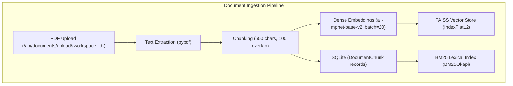
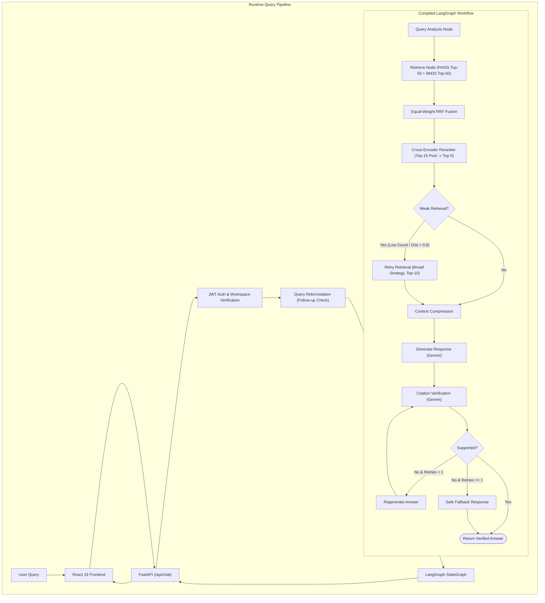

# ContextAI

ContextAI is a document-grounded Retrieval-Augmented Generation (RAG) platform designed for querying uploaded documents using hybrid retrieval, cross-encoder reranking, and an orchestrated agentic workflow with isolated workspaces.

The system combines dense semantic vector search (FAISS), sparse lexical search (BM25 with unified regex tokenization), equal-weight Reciprocal Rank Fusion (RRF), and cross-encoder reranking to optimize retrieval quality. Queries are orchestrated through a compiled LangGraph workflow that incorporates query classification, multi-turn conversational reformulation, weak-retrieval detection with automated retry, context compression, LLM answer synthesis via Google Gemini, and post-generation citation verification to eliminate unsupported claims.

---

## Key Features

- **Dense Semantic Retrieval (FAISS)**: 768-dimensional dense vector similarity search (`all-mpnet-base-v2`) via FAISS `IndexFlatL2` (with automated fallback to pure-NumPy vector indexing if native FAISS binaries are unavailable).
- **Sparse Lexical Retrieval (BM25)**: Exact keyword, code, and token matching via `rank-bm25` (BM25Okapi) with unified regex tokenization (`\b[a-zA-Z0-9_-]+\b`) preserving hyphens and underscores.
- **Hybrid Retrieval with Reciprocal Rank Fusion (RRF)**: Merges dense and lexical candidate ranks using Reciprocal Rank Fusion with equal weights (1.0 / 1.0).
- **Two-Stage Cross-Encoder Reranking**: Evaluates joint query-document interactions using `cross-encoder/ms-marco-MiniLM-L-6-v2` over a top-15 candidate pool to output final top-5 chunks.
- **Query Classification & Multi-Turn Reformulation**: Classifies query intent (semantic, keyword-focused, or broad) and rewrites conversational follow-up questions into standalone queries using prior context.
- **Weak-Retrieval Detection & Automated Retry**: Evaluates candidate sufficiency and FAISS distance thresholds; automatically triggers a broader retrieval fallback before synthesis.
- **Context Compression**: Extracts and prioritizes sentence-level evidence relevant to the question prior to prompt construction.
- **LangGraph Orchestration**: Cyclic `StateGraph` workflow managing query analysis, retrieval, retry routing, LLM generation, citation verification, single-attempt regeneration, and safe fallback responses.
- **Document Ingestion & Multi-Workspace Isolation**: PDF text extraction (`pypdf`), chunking (600 characters with 100 character overlap), embedding generation, and workspace-scoped data isolation.
- **Empirical Retrieval Evaluation Suite**: 50-question labeled evaluation dataset with 93 ground-truth relevant chunk annotations measuring Hit@5, Recall@5, MRR@5, candidate-pool recall, and latency percentiles.
- **Full-Stack Application**: FastAPI backend with JWT authentication, SQLite/SQLAlchemy persistence, and a React 19 + Vite frontend styled with Tailwind CSS.

---

## Architecture

ContextAI separates document ingestion and indexing from the runtime retrieval and generation pipeline.

### Document Ingestion Flow



### Runtime Query & LangGraph Orchestration Flow



---

## Retrieval Pipeline

ContextAI implements a two-stage hybrid retrieval and reranking pipeline designed to balance semantic understanding with exact keyword precision:

```
User Query
   │
   ├──► Dense Retrieval: FAISS IndexFlatL2 (top-50 candidates via all-mpnet-base-v2) ──┐
   │                                                                                    ▼
   └──► Sparse Retrieval: BM25Okapi (top-50 candidates via regex tokenization) ───► Equal-Weight RRF (k=10)
                                                                                        │
                                                                                        ▼
                                                                           Candidate Pool (Top 15)
                                                                                        │
                                                                                        ▼
                                                                           Cross-Encoder Reranker
                                                                           (ms-marco-MiniLM-L-6-v2)
                                                                                        │
                                                                                        ▼
                                                                           Final Retrieved Chunks (Top 5)
```

1. **Dense Retrieval (FAISS)**: Projects queries and chunks into a 768-dimensional embedding space using `all-mpnet-base-v2`. Computes L2 distances over indexed document vectors to capture semantic meaning, synonyms, and conceptual relationships.
2. **Sparse Lexical Retrieval (BM25)**: Evaluates query terms using BM25Okapi scoring. A unified regex tokenizer (`\b[a-zA-Z0-9_-]+\b`) retains alphanumeric tokens while preserving hyphens and underscores (e.g., `api_v1`, `luna-1`, `bert-base`, `768`), ensuring reliable matching for technical entities and identifiers.
3. **Equal-Weight Reciprocal Rank Fusion (RRF)**: Combines dense and sparse candidate rankings without requiring raw score normalization:
   $$\text{RRF Score}(d) = \sum_{m \in \{\text{FAISS}, \text{BM25}\}} \frac{w_m}{k + \text{rank}_m(d)}$$
   In standard retrieval, weights are set to $w_{\text{FAISS}} = 1.0$ and $w_{\text{BM25}} = 1.0$ with constant $k = 10$.
4. **Cross-Encoder Reranking**: The top-15 candidates from RRF are passed to `cross-encoder/ms-marco-MiniLM-L-6-v2`. Unlike bi-encoders that evaluate query and document embeddings independently, the cross-encoder processes query-document pairs simultaneously with full cross-attention across all tokens.
5. **Final Top-5 Selection**: The 5 highest-scoring chunks from the reranker form the retrieval context passed forward to context compression and synthesis.
6. **Weak-Retrieval Detection & Retry**: If the retrieved context is empty, fewer chunks than requested are found, or the average FAISS distance exceeds 0.8, the system flags the retrieval as weak and executes an automated broader retry (retrieval count expanded to 10 chunks with broad retrieval strategy).

---

## RAG Workflow

The query lifecycle is orchestrated as a compiled LangGraph `StateGraph`:

1. **Query Analysis (`query_node`)**: Evaluates query characteristics to determine retrieval parameters. Queries containing broad trigger terms request an expanded chunk count; keyword-focused queries adjust retrieval strategies; conversational or standard interrogatives route through standard semantic/hybrid search.
2. **Query Reformulation**: Before entering the graph, multi-turn follow-up queries (e.g., *"What about its architecture?"*, *"How does it compare?"*) are detected via regex patterns and rewritten into standalone search queries using prior conversation context via `gemini-3.5-flash-lite`.
3. **Retrieval (`retrieve_node`)**: Executes concurrent FAISS and BM25 search via `ThreadPoolExecutor`, applies equal-weight RRF fusion, and reranks the top-15 candidate pool down to top-5 chunks.
4. **Weak-Retrieval Routing (`retrieval_router` & `retry_retrieval_node`)**: Inspects retrieval output. If chunk count or distance thresholds indicate weak retrieval, routes to `retry_retrieval` to pull 10 chunks using broad search before proceeding to generation.
5. **Context Compression**: Splits retrieved chunk text into individual sentences and scores them against question keywords. Broad queries retain up to 30 sentences, while targeted queries retain up to 12 sentences, eliminating unrelated boilerplate prior to LLM input.
6. **Response Generation (`generate_node`)**: Passes the compressed context and user question to Google Gemini (`gemini-3.5-flash-lite`), prompting the model to answer using only explicit facts from the context.
7. **Citation Verification (`verify_node` & `citation_router`)**: A verification prompt checks whether every factual assertion in the generated answer is strictly supported by the retrieved context.
   - If verified (`YES`): The workflow terminates (`END`) and returns the answer with source chunk IDs.
   - If unverified (`NO`) and `regeneration_count < 1`: The graph routes to `regenerate_node` for a second generation attempt.
   - If unverified after retry: The graph routes to `safe_response_node`, returning a safe fallback: *"I couldn't verify that answer using the uploaded documents."*

---

## Document Ingestion

ContextAI processes uploaded PDF documents through a multi-stage background pipeline:

1. **Upload & Persistence**: Uploaded PDF files are saved to `backend/uploads/` and tracked in the database with status `processing`.
2. **Text Extraction**: Text is extracted page-by-page using `pypdf` (`PdfReader`).
3. **Deterministic Character Chunking**: Text is chunked using a sliding character window:
   - **Chunk Size**: 600 characters
   - **Chunk Overlap**: 100 characters
   - **Step Size**: 500 characters
4. **Batch Embedding Generation**: Embeddings are computed in batches of 20 using `sentence-transformers/all-mpnet-base-v2` (768 dimensions).
5. **Database Storage**: Chunks, document relationships, and serialized vector embeddings are committed to SQLite (`DocumentChunk` records).
6. **Index Synchronization**: The FAISS index is updated with new chunk vectors, and the BM25 index is synchronized with newly added chunk tokens. The document status transitions to `ready`.

---

## Tech Stack

| Component | Technology | Description |
| :--- | :--- | :--- |
| **Backend Framework** | FastAPI | Async REST API framework with automatic OpenAPI/Swagger documentation |
| **ASGI Server** | Uvicorn | High-performance ASGI web server |
| **Frontend Framework** | React 19 | Single-page application built with Vite |
| **Styling** | Tailwind CSS v4 | Utility-first CSS styling with `@tailwindcss/typography` |
| **RAG Orchestration** | LangGraph | Compiled `StateGraph` state machine for agentic retrieval, retry, and verification |
| **Dense Vector Search** | FAISS (`faiss-cpu`) | L2 distance similarity search (`IndexFlatL2`) with NumPy fallback |
| **Sparse Lexical Search** | `rank-bm25` | BM25Okapi lexical retrieval with unified regex tokenization |
| **Embedding Model** | `all-mpnet-base-v2` | 768-dimensional local sentence embeddings (`sentence-transformers`) |
| **Cross-Encoder Reranker**| `ms-marco-MiniLM-L-6-v2` | Cross-attention reranking transformer (`sentence-transformers`) |
| **LLM Provider** | Google Gemini | `gemini-3.5-flash-lite` via `google-genai` SDK |
| **Document Processing** | `pypdf` | Local PDF text extraction |
| **Database & ORM** | SQLite + SQLAlchemy 2.0 | Relational storage for users, workspaces, documents, chunks, and messages |
| **Database Migrations** | Alembic | Schema versioning and migration management |
| **Authentication** | PyJWT + bcrypt | Stateless JWT bearer token authentication with salted password hashing |

---

## Evaluation / Benchmarks

ContextAI includes an empirical retrieval benchmark suite evaluated against a dedicated domain dataset consisting of:
- **50 labeled test questions**
- **93 human-verified relevant chunk annotations** (questions include single-evidence and multi-evidence ground truth, averaging ~1.86 relevant chunks per query)

### Metric Definitions

- **Hit@5**: The percentage of evaluated questions for which *at least one* annotated relevant chunk appears in the final top-5 retrieved results (binary success metric).
- **Recall@5**: The macro-averaged fraction of all annotated relevant chunks retrieved in the top 5 per question ($\frac{|\text{relevant} \cap \text{retrieved}_{1..5}|}{|\text{relevant}|}$).
- **MRR@5 (Mean Reciprocal Rank @ 5)**: The reciprocal rank of the *first* relevant chunk if it appears within the top 5; $0.0$ if no relevant chunk is retrieved in the top 5.
- **Pool Recall@K (Candidate-Pool Recall)**: The fraction of all annotated relevant chunks present in the intermediate candidate pool of depth $K$ prior to reranking.

> *Note: Benchmark results are specific to the evaluated corpus and benchmark dataset and illustrate architectural tradeoffs rather than universal performance across arbitrary corpora.*

### Final Validated Benchmark: Candidate Depth Comparison

The final retrieval architecture employs **600-character chunking with 100-character overlap**, **equal-weight hybrid RRF (FAISS + BM25)**, and **cross-encoder reranking (`ms-marco-MiniLM-L-6-v2`)**. An ablation across reranker candidate pool depths demonstrates the accuracy-latency tradeoff:

| Reranker Candidate Depth | Hit@5 | Recall@5 | MRR@5 | Pool Recall (Candidate Pool) | Zero-Hit Questions | Average Latency | P95 Latency |
| :---: | :---: | :---: | :---: | :---: | :---: | :---: | :---: |
| **Depth 10** | 92.00% | 61.49% | 0.7650 | 62.86% (Pool@10) | 4 / 50 | ~101.95 ms | ~122.52 ms |
| **Depth 15 (Selected)** | **98.00%** | **65.33%** | **0.8117** | **68.79%** (Pool@15) | **1 / 50** | **~143.76 ms** | **~173.93 ms** |
| **Depth 20** | 96.00% | 65.13% | 0.8023 | 71.11% (Pool@20) | 2 / 50 | ~204.75 ms | ~265.94 ms |

### Engineering Tradeoff Analysis

- **Why Candidate Depth 15 was selected**:
  - Increasing the candidate pool from depth 10 to depth 15 improved **Hit@5 from 92.00% to 98.00%** (+6.00 pp) and reduced zero-hit failures from 4 questions to just 1 question out of 50.
  - **Recall@5** increased from **61.49% to 65.33%** (+3.84 pp) and **MRR@5** improved from **0.7650 to 0.8117** (+0.0467).
  - Expanding to depth 20 yielded diminishing returns: candidate-pool recall increased slightly to 71.11%, but final Hit@5 dropped to 96.00% due to reranker scoring variance over deeper candidate lists, while latency increased by +42% (to ~204.75 ms avg / ~265.94 ms P95).
  - **Depth 15** represents the optimal operating point: near-complete first-result capture (98% Hit@5), strong ranking precision (0.8117 MRR@5), and predictable sub-200ms P95 latency on CPU.

---

## Project Structure

```
ContextAI/
├── backend/
│   ├── app/
│   │   ├── api/                     # FastAPI route controllers
│   │   │   ├── auth.py              # User registration and JWT login
│   │   │   ├── chat.py              # Chat endpoints, multi-turn history, query reformulation
│   │   │   ├── dependencies.py      # Auth and user dependency injection
│   │   │   ├── documents.py         # PDF upload, chunking, and background processing
│   │   │   └── workspaces.py        # Workspace CRUD endpoints
│   │   ├── core/                    # Core configuration and security
│   │   │   ├── constants.py         # Broad keyword dictionaries
│   │   │   └── security.py          # Password hashing and JWT helpers
│   │   ├── database/                # Database configuration
│   │   │   └── database.py          # SQLite engine and session factory
│   │   ├── models/                  # SQLAlchemy ORM models
│   │   │   ├── conversation.py      # Conversation model
│   │   │   ├── document.py          # Document metadata and extraction status
│   │   │   ├── document_chunk.py    # Chunk content and embedding records
│   │   │   ├── message.py           # Chat messages and source references
│   │   │   ├── user.py              # User accounts
│   │   │   └── workspace.py         # Workspace definitions
│   │   ├── schemas/                 # Pydantic schemas
│   │   │   └── workspace.py         # Workspace validation schemas
│   │   ├── services/                # Core business and retrieval logic
│   │   │   ├── agents/              # LangGraph workflow and agent nodes
│   │   │   │   ├── orchestrator.py  # LangGraph pipeline runner
│   │   │   │   ├── query_agent.py   # Query intent analysis
│   │   │   │   ├── rag_graph.py     # StateGraph definition, conditional edges, and compilation
│   │   │   │   ├── response_agent.py# Gemini prompt execution
│   │   │   │   └── retrieval_agent.py# Concurrent FAISS + BM25, RRF, reranking, and retry
│   │   │   ├── bm25_service.py      # BM25Okapi index with regex tokenizer
│   │   │   ├── chunking_service.py  # 600-char / 100-overlap text chunker
│   │   │   ├── citation_verifier.py # LLM-based factual citation verification
│   │   │   ├── context_compression_service.py # Sentence-level context compression
│   │   │   ├── embedding_service.py # all-mpnet-base-v2 local sentence encoder
│   │   │   ├── pdf_service.py       # pypdf extraction utility
│   │   │   ├── query_reformulation_service.py # Multi-turn conversational rewrite service
│   │   │   ├── reranker_service.py  # CrossEncoder reranking service
│   │   │   └── vector_service.py    # FAISS / NumPy vector index manager
│   │   └── main.py                  # FastAPI application entry point, CORS, startup hooks
│   ├── benchmarks/                  # Evaluation harness and datasets
│   │   ├── benchmark_questions_labeled.json # 50 labeled benchmark questions
│   │   ├── candidate_depth_ablation_results.json # Validated depth ablation data
│   │   ├── final_600_100_validation_results.json # Final 600/100 benchmark outputs
│   │   ├── metrics.py               # Hit@K, Recall@K, and MRR@K metric calculations
│   │   ├── run_benchmark.py         # Evaluation execution script
│   │   └── run_chunking_ablation.py # Chunking ablation harness
│   ├── alembic/                     # Database migrations
│   ├── pyproject.toml               # Python project configuration (uv compatible)
│   └── requirements.txt             # Pip-compatible requirements
├── frontend/
│   ├── src/
│   │   ├── components/              # UI layout, Navbar, and ProtectedRoute components
│   │   ├── context/                 # AuthContext and ThemeContext
│   │   ├── pages/                   # Application views (Chat, Dashboard, Upload, Login, Signup)
│   │   ├── services/api.js          # Axios API client with auth interceptors
│   │   ├── App.jsx                  # React application router
│   │   └── main.jsx                 # Application entry point
│   ├── package.json                 # Frontend dependencies and npm scripts
│   └── vite.config.js               # Vite build configuration
└── README.md
```

---

## Setup and Installation

### Prerequisites
- Python 3.10+
- Node.js 18+
- [uv](https://docs.astral.sh/uv/) (recommended for Python environment management) or `pip`
- Google Gemini API Key ([Google AI Studio](https://aistudio.google.com/))

---

### 1. Backend Setup

Clone the repository and install dependencies using `uv` or standard Python `venv`:

```bash
cd backend

# Option A: Using uv (recommended)
uv sync

# Option B: Using standard Python venv
python -m venv .venv
# On Windows (PowerShell):
.\.venv\Scripts\Activate.ps1
# On Linux/macOS:
# source .venv/bin/activate
pip install -r requirements.txt
```

#### Run Database Migrations (or let FastAPI auto-create tables)

FastAPI automatically initializes database tables on startup. If applying Alembic migrations:

```bash
uv run alembic upgrade head
```

---

### 2. Frontend Setup

```bash
cd frontend
npm install
```

---

## Environment Variables

### Backend Configuration (`backend/.env`)

Create a `.env` file inside the `backend/` directory:

```env
# Required: Google Gemini API key for response synthesis, reformulation, and verification
GEMINI_API_KEY=your_gemini_api_key_here

# Optional: JWT signing secret (defaults to development key if not specified)
SECRET_KEY=your_secure_random_jwt_secret_key
```

### Frontend Configuration (`frontend/.env`)

Optionally configure the backend API target URL in `frontend/.env`:

```env
# Defaults to http://127.0.0.1:8000 if omitted
VITE_API_URL=http://127.0.0.1:8000
```

---

## Running the Application

### Start the Backend Server

From the `backend` directory:

```bash
# Using uv:
uv run uvicorn app.main:app --reload

# Using activated virtual environment:
uvicorn app.main:app --reload
```

The backend server will run at `http://127.0.0.1:8000`.

### Start the Frontend Client

From the `frontend` directory:

```bash
npm run dev
```

The React frontend interface will be accessible at `http://localhost:5173`.

---

## API Documentation

FastAPI automatically serves interactive OpenAPI documentation:

- **Swagger UI**: Accessible at `http://127.0.0.1:8000/docs`
- **ReDoc**: Accessible at `http://127.0.0.1:8000/redoc`

Key API routes:
- `POST /api/auth/signup` & `POST /api/auth/login`: User registration and JWT authentication
- `GET /api/workspaces/` & `POST /api/workspaces/`: Workspace management
- `POST /api/documents/upload/{workspace_id}`: PDF document upload and asynchronous background ingestion
- `GET /api/documents/?workspace_id={id}`: Document status and listing
- `GET /api/chat/?query={query}&workspace_id={id}`: RAG query execution with optional multi-turn conversation tracking

---

## Limitations

- **Text Extraction Formatting**: The document pipeline relies on `pypdf`, which extracts plain sequential text but does not reconstruct complex multi-column layouts, embedded tables, or image captions.
- **Source Citation Granularity**: The current citation verification system tags chunks at the chunk-ID level rather than mapping exact source page numbers or visual bounding boxes.
- **Benchmark Corpus Scope**: The evaluated benchmark comprises 50 labeled questions over a technical document corpus; retrieval metrics may vary across different corpora, formats, or domain languages.
- **External LLM Availability**: Answer synthesis, conversational query reformulation, and citation verification depend on external API calls to Google Gemini (`gemini-3.5-flash-lite`).

---

## Future Improvements

- **Page-Level Source Attribution**: Integrate coordinate and page-number metadata extraction into `pypdf` ingestion to provide page-exact PDF citation links in the UI.
- **Interactive Citation Highlighting**: Enhance the frontend chat interface to highlight exact source sentence passages within the document viewer when a citation is selected.
- **End-to-End Answer Evaluation**: Implement an automated offline evaluation pipeline for answer faithfulness and factual correctness (e.g., using Ragas or TruLens).
- **Containerization**: Provide official `Dockerfile` and `docker-compose.yml` configurations for unified backend, frontend, and persistent volume deployment.
- **Multi-Query Expansion**: Explore generating multiple diverse sub-queries for complex comparative questions prior to hybrid retrieval.
