# ContextAI

ContextAI is an engineered, production-ready Retrieval-Augmented Generation (RAG) platform designed for document-grounded question answering across isolated multi-tenant workspaces. 

It combines dense semantic vector retrieval (FAISS), sparse lexical keyword search (BM25Okapi), adaptive Reciprocal Rank Fusion (RRF), cross-encoder reranking, and an agentic LangGraph execution pipeline with query reformulation and automated citation verification.

---

## Features

- **Multi-Workspace Isolation**: Document storage, embeddings, and retrieval are strictly scoped per workspace and user.
- **PDF Document Processing**: Ingestion pipeline extracts text via `pypdf`, partitions content into overlapping chunks (4,000 characters with 500-character overlap), and generates 768-dimensional dense vector embeddings.
- **Dense Vector Search (FAISS)**: Fast L2/Inner-Product vector index using local `all-mpnet-base-v2` embeddings for deep semantic similarity.
- **Sparse Keyword Search (BM25)**: Lexical indexing via `rank-bm25` (BM25Okapi) to ensure exact term matching for acronyms, identifiers, and specific keywords.
- **Adaptive Hybrid Retrieval (RRF)**: Weighted Reciprocal Rank Fusion dynamically balances semantic vs. keyword ranking based on intent classification (semantic, keyword-focused, or broad exhaustive queries).
- **Dual User-Selectable Retrieval Modes**:
  - **⚡ Fast Mode**: Sub-10ms hybrid retrieval (FAISS + BM25 + RRF) delivering 70.00% Recall@5 with zero reranker overhead.
  - **🎯 Accurate Mode**: Deep 2-stage retrieval fusing top-50 candidates through a Cross-Encoder (`ms-marco-MiniLM-L-2-v2`) reranker, achieving 82.00% Recall@5.
- **Agentic LangGraph Orchestration**:
  - **Query Analysis**: Identifies question intent and selects adaptive retrieval strategies and context budgets.
  - **Query Reformulation**: Automatically resolves pronouns and contextual references in conversational follow-ups.
  - **Weak Retrieval Retry**: Detects low confidence/empty contexts and automatically broadens search parameters.
  - **Context Compression**: Sentence-level relevance filtering to maximize signal-to-noise ratio in prompt contexts.
  - **Citation Verification**: Validates generated answers against the source context to eliminate hallucinations before returning responses.
- **Empirical Ground-Truth Benchmarking**: Built-in benchmark suite with 50 ground-truth labeled questions measuring Recall@5, latency distributions, and component-level profiling.
- **Modern Full-Stack Interface**: React 19 + Vite frontend with Tailwind CSS, Markdown/citations rendering, workspace management, and light/dark theme support.

---

## Architecture

```mermaid
flowchart TD
    subgraph Ingestion["Document Ingestion Pipeline"]
        PDF["PDF Document"] --> TextExtract["Text Extraction (pypdf)"]
        TextExtract --> Chunker["Text Chunking (4000 chars / 500 overlap)"]
        Chunker --> DB["SQLite Database (DocumentChunk)"]
        Chunker --> Embed["Embedding Generation (all-mpnet-base-v2)"]
        Embed --> FAISSIndex["FAISS Vector Index (768-dim)"]
        DB --> BM25Index["BM25 Index (BM25Okapi)"]
    end

    subgraph QueryExecution["Query Execution Pipeline"]
        UserQuery["User Question"] --> Reformulate["Query Reformulation (Follow-up Context)"]
        Reformulate --> QueryAgent["Query Analysis Agent"]
        
        QueryAgent --> ModeCheck{"Retrieval Mode"}
        
        ModeCheck -->|"Fast Mode"| HybridFast["Concurrent Retrieval<br/>FAISS (top 50) + BM25 (top 50)"]
        ModeCheck -->|"Accurate Mode"| HybridAccurate["Concurrent Retrieval<br/>FAISS (top 50) + BM25 (top 50)"]
        
        HybridFast --> RRFFast["Weighted RRF Fusion"]
        RRFFast --> TopK["Top-K Candidate Chunks"]
        
        HybridAccurate --> RRFAccurate["Weighted RRF Fusion (Top 50)"]
        RRFAccurate --> Reranker["Cross-Encoder Reranker<br/>(ms-marco-MiniLM-L-2-v2)"]
        Reranker --> TopK
        
        TopK --> WeakCheck{"Weak Retrieval?"}
        WeakCheck -->|"Yes (Low Distance/Count)"| RetryRetrieval["Retry Retrieval (Broad Strategy)"]
        RetryRetrieval --> ContextComp["Context Compression"]
        WeakCheck -->|"No"| ContextComp
        
        ContextComp --> ResponseAgent["Response Agent (Gemini LLM)"]
        ResponseAgent --> CitationAgent["Citation Verifier"]
        CitationAgent --> VerifiedAnswer["Final Answer + Sources"]
    end
```



---

## Retrieval Modes

ContextAI provides two retrieval profiles tailored to different operational requirements:

### 1. ⚡ Fast Mode (Default)
- **Pipeline**: Query Embedding $\rightarrow$ Concurrent FAISS + BM25 Retrieval $\rightarrow$ Weighted Reciprocal Rank Fusion $\rightarrow$ Top-K Chunks $\rightarrow$ LLM Answer.
- **Recall@5**: **70.00%**
- **Average Retrieval Latency**: **~6.5 ms** (0.0065s)
- **P95 Latency**: **~7.6 ms** (0.0076s)
- **Use Case**: Real-time conversational search and high-throughput interactive querying where sub-second response times are prioritized.

### 2. 🎯 Accurate Mode
- **Pipeline**: Query Embedding $\rightarrow$ Concurrent FAISS + BM25 Retrieval $\rightarrow$ Weighted RRF (Top 50 candidates) $\rightarrow$ Cross-Encoder Reranker (`cross-encoder/ms-marco-MiniLM-L-2-v2`) $\rightarrow$ Top-K Chunks $\rightarrow$ LLM Answer.
- **Recall@5**: **82.00%** (+12.00 percentage points over Fast Mode)
- **Average Retrieval Latency**: **~2.28 s** (2.2822s)
- **P95 Latency**: **~2.15 s** (2.1503s)
- **Use Case**: Deep document research, compliance, complex technical documentation, and high-stakes queries where retrieval quality outweighs inference latency.

---

## Benchmarking and Evaluation

The system was evaluated against **50 benchmark questions** with verified ground-truth chunk labels across ingested document collections.

### Summary Results

| Retrieval Strategy | Hits / 50 | Recall@5 | Avg Latency | P95 Latency | Relative Improvement |
| :--- | :---: | :---: | :---: | :---: | :---: |
| **FAISS Only** (Dense Vector) | 32 / 50 | **64.00%** | 7.3 ms | 13.7 ms | Baseline |
| **Hybrid Search** (FAISS + BM25 + RRF) | 35 / 50 | **70.00%** | 6.5 ms | 7.6 ms | **+6.00 pp** vs FAISS |
| **Hybrid + Reranker** (Cross-Encoder) | 41 / 50 | **82.00%** | 2,282.2 ms | 2,150.3 ms | **+18.00 pp** vs FAISS / **+12.00 pp** vs Hybrid |

> **Key Takeaway**: Hybrid search immediately recovers missing keyword-specific documents (+6% recall) with zero latency penalty, while deep Cross-Encoder reranking pushes recall up to 82% by evaluating semantic token interactions directly against candidate chunks.

---

## Granular Performance Profiling

Component-level latency profiling across 50 benchmark evaluations highlights where time is spent across the retrieval stack:

```
Granular Profiling Breakdown (Average / P95):
----------------------------------------------------------------------
Query Embedding Generation (SentenceTransformer) : 158.2 ms / 160.4 ms
FAISS Vector Search (top-50)                    :   0.8 ms /   0.9 ms
BM25 Keyword Search (top-50)                    :   2.9 ms /   4.0 ms
Reciprocal Rank Fusion (RRF)                    :   0.1 ms /   0.2 ms
Cross-Encoder Reranking (50 pairs on CPU)       : 2,276.7 ms / 2,143.7 ms
LLM Generation & Graph Orchestration            : 1,400–1,700 ms
----------------------------------------------------------------------
```

### Key Bottleneck Insights
1. **FAISS search is sub-millisecond**: Searching dense vector space takes less than 1 ms for top-50 results.
2. **Embedding generation is the initial bottleneck**: Generating dense vector embeddings on CPU takes ~150 ms, accounting for >95% of standard retrieval latency.
3. **Cross-Encoder compute cost**: The transformer-based cross-encoder calculates self-attention over all (query, document) pairs, requiring ~2.2s on CPU.

---

## Tech Stack

### Backend
- **Framework**: [FastAPI](https://fastapi.tiangolo.com/) (Python 3.13+) with [Uvicorn](https://www.uvicorn.org/) ASGI server
- **Database & ORM**: [SQLAlchemy 2.0](https://www.sqlalchemy.org/) with [Alembic](https://alembic.sqlalchemy.org/) migrations & SQLite
- **Orchestration**: [LangGraph](https://github.com/langchain-ai/langgraph) (StateGraph agent workflow)
- **Authentication**: JWT (`PyJWT`) with `bcrypt` password hashing
- **Validation**: [Pydantic v2](https://docs.pydantic.dev/)

### Retrieval & AI
- **Vector Store**: [FAISS](https://github.com/facebookresearch/faiss) (`faiss-cpu`)
- **Sparse Search**: [rank-bm25](https://github.com/dorianbrown/rank_bm25) (`BM25Okapi`)
- **Embedding Model**: [sentence-transformers](https://www.sbert.net/) `all-mpnet-base-v2` (768 dimensions)
- **Reranker Model**: `cross-encoder/ms-marco-MiniLM-L-2-v2`
- **LLM Provider**: Google Gemini (`google-genai` SDK, `gemini-3.5-flash-lite`)
- **Document Ingestion**: `pypdf`

### Frontend
- **Framework**: [React 19](https://react.dev/) + [Vite](https://vitejs.dev/)
- **Routing**: [React Router v7](https://reactrouter.com/)
- **Styling**: [Tailwind CSS v4](https://tailwindcss.com/) with `@tailwindcss/typography`
- **Icons**: [Lucide React](https://lucide.dev/)
- **Markdown**: `react-markdown` + `remark-gfm`
- **Theme**: Persistent CSS variable-based Light & Dark modes

---

## Project Structure

```
ContextAI/
├── backend/
│   ├── app/
│   │   ├── api/                     # REST API route handlers
│   │   │   ├── auth.py              # User signup, login, session info
│   │   │   ├── chat.py              # Conversational QA endpoint (/api/chat)
│   │   │   ├── dependencies.py      # Auth and DB dependency injection
│   │   │   ├── documents.py         # PDF upload, ingestion, status
│   │   │   ├── search.py            # Direct search endpoints
│   │   │   └── workspaces.py        # Workspace CRUD operations
│   │   ├── core/
│   │   │   ├── constants.py         # Global constants (e.g., BROAD_KEYWORDS)
│   │   │   └── security.py          # Password hashing and JWT helpers
│   │   ├── database/
│   │   │   └── database.py          # SQLite engine and session setup
│   │   ├── models/                  # SQLAlchemy ORM models
│   │   │   ├── conversation.py      # Chat conversations
│   │   │   ├── document.py          # Uploaded document metadata
│   │   │   ├── document_chunk.py    # Text chunks and vector references
│   │   │   ├── message.py           # Chat message history
│   │   │   ├── user.py              # User accounts
│   │   │   └── workspace.py         # Workspace containers
│   │   ├── schemas/                 # Pydantic request/response schemas
│   │   ├── services/                # Core domain and retrieval services
│   │   │   ├── agents/              # LangGraph multi-agent implementation
│   │   │   │   ├── orchestrator.py  # Pipeline execution entry point
│   │   │   │   ├── query_agent.py   # Intent analysis & strategy selector
│   │   │   │   ├── rag_graph.py     # StateGraph workflow definition
│   │   │   │   ├── response_agent.py# LLM answer synthesis
│   │   │   │   └── retrieval_agent.py# Hybrid FAISS/BM25/Reranker logic
│   │   │   ├── bm25_service.py      # BM25 index management and lookup
│   │   │   ├── chunking_service.py  # Text chunking logic
│   │   │   ├── citation_verifier.py # Source citation hallucination checks
│   │   │   ├── context_compression_service.py # Sentence extraction
│   │   │   ├── embedding_service.py # SentenceTransformer embedding generation
│   │   │   ├── pdf_service.py       # PDF text extraction
│   │   │   ├── query_reformulation_service.py # Query resolution
│   │   │   ├── reranker_service.py  # CrossEncoder reranker service
│   │   │   └── vector_service.py    # FAISS vector store service
│   │   └── main.py                  # FastAPI application entry point
│   ├── benchmarks/                  # Evaluation & benchmark suite
│   │   ├── benchmark_questions_labeled.json # Ground-truth benchmark dataset
│   │   ├── experimental/            # Experimental retrieval models (HyDE)
│   │   ├── generate_ground_truth.py # Automated ground truth generation
│   │   ├── label_ground_truth.py    # Interactive labeling script
│   │   └── run_benchmark.py         # End-to-end benchmark & profiling runner
│   ├── requirements.txt             # Cleaned backend dependencies
│   └── pyproject.toml               # Python project configuration
├── frontend/
│   ├── src/
│   │   ├── components/              # Reusable UI components (Sidebar, Layout)
│   │   ├── context/                 # AuthContext and ThemeContext
│   │   ├── pages/                   # Application views
│   │   │   ├── Chat.jsx             # Chat interface with Fast/Accurate toggle
│   │   │   ├── Dashboard.jsx        # Workspace overview & statistics
│   │   │   ├── Landing.jsx          # Public landing page
│   │   │   ├── Login.jsx            # User authentication
│   │   │   ├── Settings.jsx         # User preferences & theme toggle
│   │   │   ├── Signup.jsx           # Account registration
│   │   │   └── Upload.jsx           # Document drag-and-drop uploader
│   │   ├── services/api.js          # Axios client with auth interceptors
│   │   ├── App.jsx                  # Route definitions
│   │   ├── index.css                # Tailwind CSS & theme tokens
│   │   └── main.jsx                 # React root mounting
│   └── package.json                 # Frontend dependencies and scripts
└── README.md
```

---

## Installation & Setup

### Prerequisites
- **Python**: Version 3.10+ (tested on Python 3.13)
- **Node.js**: Version 18+ (tested on Node.js 20+)
- **Google Gemini API Key**: Obtainable from [Google AI Studio](https://aistudio.google.com/)

---

### 1. Backend Setup

```bash
# Navigate to the backend directory
cd backend

# Create and activate a virtual environment
python -m venv .venv

# On Windows (PowerShell):
.\.venv\Scripts\Activate.ps1
# On Linux / macOS:
# source .venv/bin/activate

# Install dependencies
pip install -r requirements.txt

# Configure environment variables
# Create a .env file in the backend directory:
# (See Environment Variables section below)

# Start the FastAPI server
uvicorn app.main:app --reload
```
The backend API will be available at `http://127.0.0.1:8000`. Interactive API documentation is accessible at `http://127.0.0.1:8000/docs`.

---

### 2. Frontend Setup

```bash
# Open a new terminal and navigate to the frontend directory
cd frontend

# Install dependencies
npm install

# Start the Vite development server
npm run dev
```
The frontend web application will be accessible at `http://localhost:5173`.

---

## Environment Variables

Create a `.env` file in the `backend/` directory:

```env
# Required for Gemini LLM generation, query reformulation, and citation checks
GEMINI_API_KEY=your_gemini_api_key_here

# Optional: JWT Secret Key (a secure random string in production)
SECRET_KEY=your_super_secret_jwt_key_here
```

### Frontend Configuration (Optional)
Create a `.env` file in the `frontend/` directory if connecting to a non-default backend host:
```env
VITE_API_URL=http://127.0.0.1:8000
```

---

## Running Benchmarks

ContextAI includes a dedicated benchmarking tool to validate retrieval recall and profile execution latencies.

```bash
# Ensure backend virtual environment is active
cd backend

# Run the comprehensive benchmark suite
python benchmarks/run_benchmark.py
```

The script evaluates:
1. **FAISS Only**: Raw vector search Recall@5 and latency.
2. **Hybrid (FAISS + BM25 + RRF)**: Multi-modal fusion Recall@5 and latency.
3. **Hybrid + Reranker**: Cross-Encoder reranked Recall@5 and latency.
4. **Experimental HyDE**: Hypothetical document embedding comparison.
5. **Granular Profiling**: Per-stage average and P95 latency breakdown.

---

## Key Engineering Findings

1. **Hybrid search outperforms pure vector search**: Combining sparse BM25 keyword matching with dense FAISS vectors increased Recall@5 from **64% to 70%** without adding meaningful latency (~6.5 ms).
2. **Cross-Encoder reranking provides the highest precision**: Re-scoring top-50 candidates with `ms-marco-MiniLM-L-2-v2` pushed Recall@5 to **82%** (+12 pp increase), but introduced ~2.28s of CPU inference time.
3. **Vector search is not the bottleneck**: FAISS search executes in under 1 ms. Dense embedding generation on CPU (~150 ms) is the dominant latency source for standard retrieval.
4. **Dual retrieval modes give users control**: Exposing **Fast** vs. **Accurate** modes allows users to choose between real-time responsiveness and exhaustive accuracy.

---

## Limitations

- **Benchmark Sample Size**: The current evaluation suite is measured on a curated dataset of 50 ground-truth questions.
- **CPU Reranker Latency**: Running Cross-Encoder self-attention across 50 pairs on CPU takes ~2.2 seconds per query.
- **Single-Node Storage**: SQLite and local FAISS indices are designed for single-node deployment and require rebuilding on cold starts.
- **Fixed Metric**: Evaluation is presently centered around Recall@5.

---

## Future Improvements

- **Accelerated Inference**: Quantized / ONNX Runtime execution or GPU support for sub-500ms reranker latency.
- **Expanded Evaluation**: Adding NDCG@10, Mean Reciprocal Rank (MRR), and multi-hop reasoning datasets.
- **Additional Formats**: Expanding text extractors to support DOCX, XLSX, Markdown, and scanned OCR documents.
- **Distributed Vector Stores**: Migration options for PostgreSQL + `pgvector` or Qdrant for enterprise horizontal scaling.
